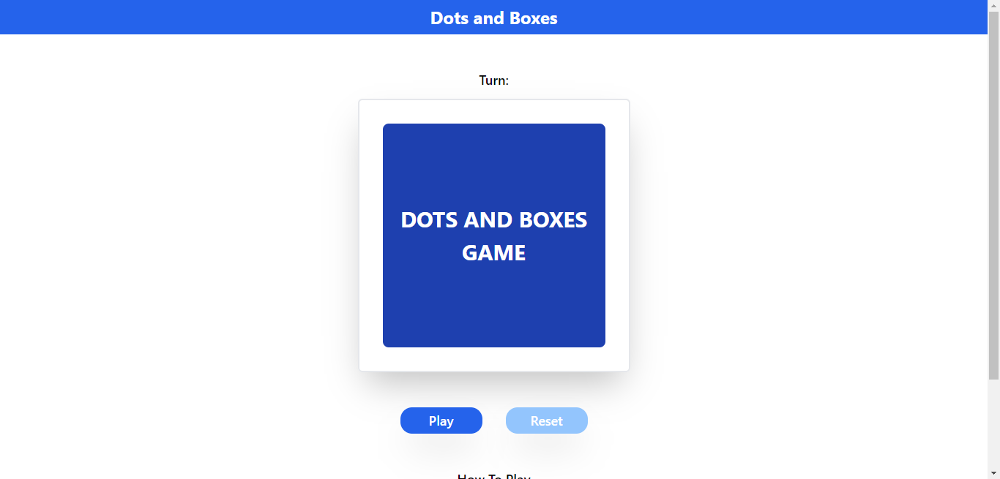
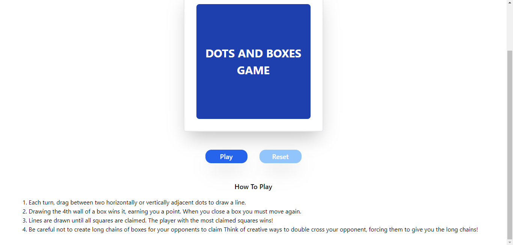
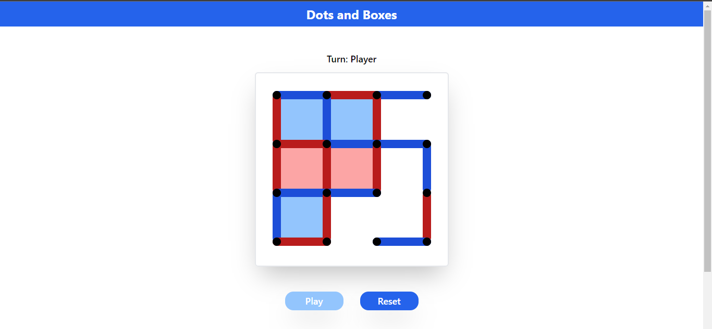
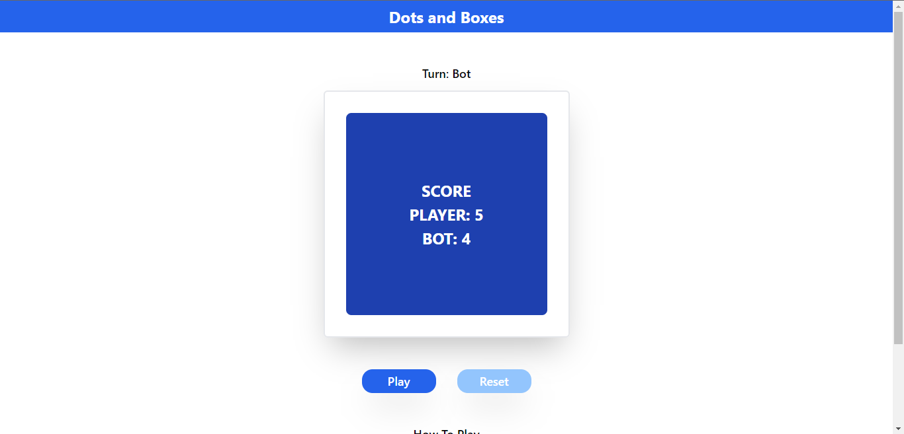

# DOTS AND BOXES GAME USING REACT JS AND FLASK

**Dots and Boxes** is a fun and simple classic pen-and-paper game for 2 or more players. The game starts with an empty grid of dots. The grid can be any size and Gametable's Dots and Boxes has a handful to choose from. Usually a coin is flipped or Rock-Paper-Scissors is played to see who goes first, but in Gametable's Tabletop Dots and Boxes, Player 1 always starts first. Players take turns connecting 2 unjoined horizontally or vertically adjacent dots. A player who completes the fourth side of a 1x1 box earns one point and must take another turn. The game ends when all lines are drawn and boxes are claimed. The player with the most points wins. If more than one player has the same high score, the game is a tie.

## STRATEGY

The strategy used by bots is to maximize the box obtained and minimize the box obtained by the opponent. The algorithm used for bots is the minimax alpha-beta pruning algorithm. Minimax is a kind of backtracking algorithm that is used in decision making and game theory to find the optimal move for a player, assuming that your opponent also plays optimally. It is widely used in two player turn-based games such as Tic-Tac-Toe, Backgammon, Mancala, Chess, etc. In Minimax the two players are called maximizer and minimizer. The maximizer tries to get the highest score possible while the minimizer tries to do the opposite and get the lowest score possible. Alpha–beta pruning is a search algorithm that seeks to decrease the number of nodes that are evaluated by the minimax algorithm in its search tree.

## HOW TO INSTALL AND RUN THE APPLICATION

### SERVER

1. Install Python
2. Open terminal and change directory to server folder
3. Create a virtual environment using the command `python -m venv env`
4. activate the virtual environment with the command `env\Scripts\activate`
5. Install dependencies using then command `pip install -r requirements.txt`
6. Run the server using the command `python main.py`

### CLIENT

1. Install Node.js
2. Open terminal, then change directory to client and run `npm install` command to install all dependencies.
3. Once done, run the command `npm start` to display the web browser view on the client side.

 

  

  

  

  

